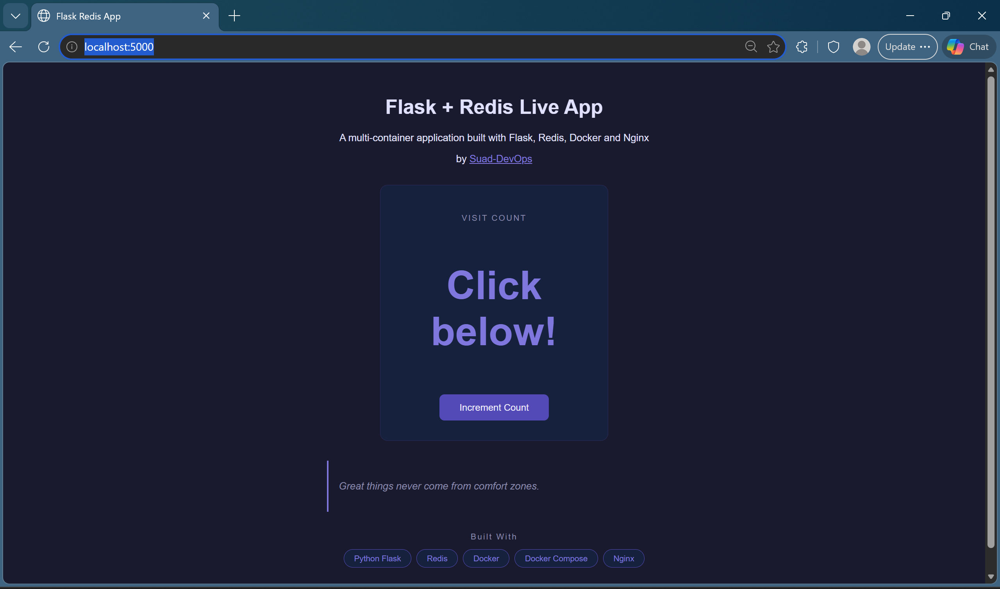
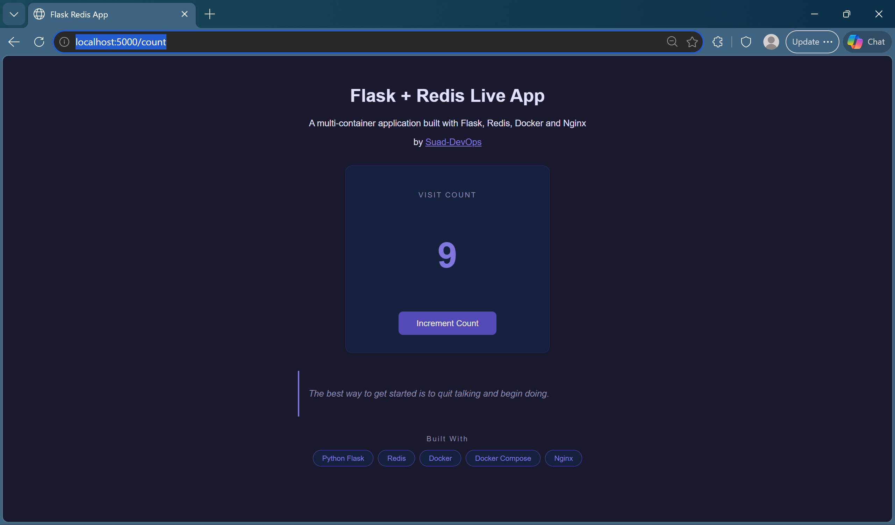

# Flask Redis Live App with Docker and NGINX

## 📄 Project Description
For this project I built a multi-container web application using Python Flask and Redis. Docker Compose is used to run and manage all the containers together. The Flask app has two routes, one that shows a welcome page and one that tracks how many times it has been visited, storing that count in Redis.

To make sure the visit count does not disappear when the containers are stopped, I configured a Docker volume for Redis. I also set up environment variables so the Flask app can read the Redis connection details without them being hardcoded in the code.

To make the app scalable, I ran multiple instances of the Flask service with NGINX sitting in front as a reverse proxy and load balancer, spreading the traffic between them. I also built a dark themed frontend using HTML and CSS with a live visit counter and random motivational quotes.

---

## 🛠️ Technologies Used
- Python (Flask)
- Redis
- NGINX
- Docker & Docker Compose
- HTML & CSS

---


## 📁 Project Structure

```
containers-challenge/
├── app/
│   ├── templates/
│   │   └── index.html
│   ├── app.py
│   ├── Dockerfile
│   ├── nginx.conf
│   └── requirements.txt
├── images/
│   ├── count-number.png
│   └── welcome-page.png
├── .gitignore
├── docker-compose.yml
└── README.md
```

## 📸 Screenshots

### Welcome Page


### Visit Counter


---

## Dockerfile, Images and Containers

### Dockerfile
A Dockerfile is a set of instructions that tells Docker how to build an image. I created a Dockerfile for the Flask app. For Redis and NGINX I used the official images from Docker Hub so no Dockerfile was needed for those.

### Images
An image is like a blueprint for a container. It contains everything needed to run the app including the code, libraries and configuration. Once an image is built it cannot be changed. The Flask app uses a custom image built from my Dockerfile. Redis and NGINX both use their official images from Docker Hub.

### Containers
A container is an isolated environment where part of your app runs. In this project Flask, Redis and NGINX each run in their own container. Because the Flask service can be scaled, multiple Flask containers can run at the same time to handle more traffic.

---

## Docker Compose
Docker Compose lets you define and run multiple containers using a single yaml file. Instead of starting each container manually you just run one command and Docker Compose handles everything. It manages the ports, volumes, environment variables and how the containers communicate with each other.

### docker-compose.yml
```yaml
version: "3"
services:
  web:
    build: ./app
    environment:
      - REDIS_HOST=redis
      - REDIS_PORT=6379
  nginx:
    image: nginx
    ports:
      - "5000:80"
    volumes:
      - ./app/nginx.conf:/etc/nginx/conf.d/default.conf
    depends_on:
      - web
  redis:
    image: redis
    volumes:
      - redis-data:/data
volumes:
  redis-data:
```

---

## Redis
I used a Docker volume to give Redis persistent storage. Without a volume, all the data stored in Redis would be lost every time the container stops. By mounting a named volume to the /data path inside the Redis container, the visit count survives container restarts and removals.

```yaml
  redis:
    image: redis
    volumes:
      - redis-data:/data
```

---

## Environment Variables
Instead of hardcoding the Redis host and port directly in app.py, I used environment variables. This means I can change the configuration in docker compose.yml without touching the application code. It also makes the app more flexible across different environments.

```python
redis = Redis(
  host=os.environ.get('REDIS_HOST', 'redis'),
  port=int(os.environ.get('REDIS_PORT', 6379))
)
```

---

## NGINX
I used NGINX as a reverse proxy and load balancer. Instead of the browser talking directly to Flask, all requests go through NGINX first and it decides which Flask instance handles each request. This is really useful when scaling because it spreads the traffic evenly across all running Flask containers.

```yaml
  nginx:
    image: nginx
    ports:
      - "5000:80"
```

---

## ⚙️ Set Up

1. Clone the repository
```bash
git clone https://github.com/Suad-DevOps/containers-challenge.git
cd containers-challenge
```

2. Start the application
```bash
docker compose up -d --build
```

3. Scale Flask to multiple instances
```bash
docker compose up -d --scale web=3
```

4. Open your browser and go to
http://localhost:5000

5. Tear down the containers
```bash
docker compose down
```

---

## Testing the App
The Flask app has two routes:
- `/` — Shows the welcome page with a random motivational quote and visit counter
- `/count` — Increments the visit count in Redis and displays it on the page

---

Built by [Suad-DevOps](https://github.com/Suad-DevOps)

